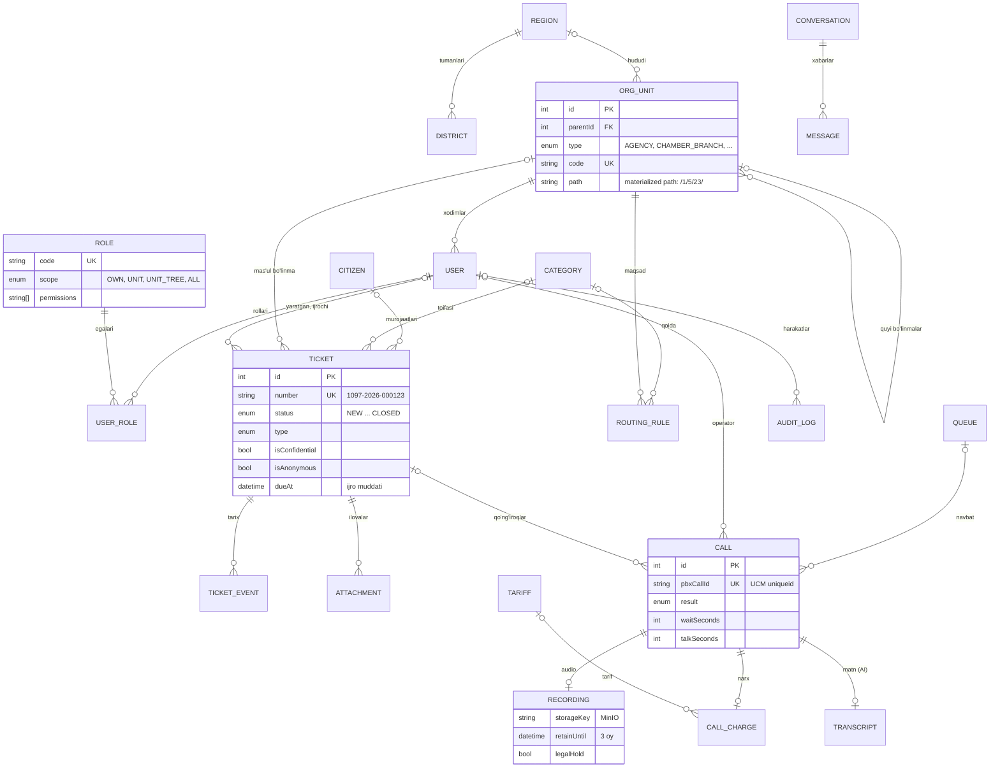

# Ma'lumotlar bazasi sxemasi

PostgreSQL 16, 38 ta jadval, 9 guruh. Manba: [`apps/backend/prisma/schema.prisma`](../apps/backend/prisma/schema.prisma), migratsiyalar: [`apps/backend/prisma/migrations`](../apps/backend/prisma/migrations).

Markazda **Murojaat (tickets)** turadi: u fuqaro, toifa, hudud, mas'ul bo'linma, ijrochi va qo'ng'iroqlar bilan bog'lanadi. Har bir o'zgarish `ticket_events` jadvaliga yoziladi.

## ER-diagramma (asosiy ob'ektlar)



## Jadvallar

| Guruh | Jadval | Vazifasi |
| --- | --- | --- |
| Tuzilma | `regions`, `districts` | Viloyat va tumanlar (SOATO kodi bilan) |
| | `org_units` | Agentlik tuzilmasi daraxti: markaziy apparat, hududiy boshqarmalar, DKP va filiallar, tasarrufidagi tashkilotlar, call-markaz |
| Foydalanuvchilar | `users` | Xodimlar: bo'linma, SIP ichki raqami, bloklash maydonlari, 2FA |
| | `roles`, `user_roles` | Rollar: ko'rish doirasi (`scope`) va ruxsatlar ro'yxati |
| Fuqarolar | `citizens` | Murojaatchi: telefon (E.164, noyob), F.I.Sh., JShShIR |
| Murojaatlar | `tickets` | Murojaat: raqam, kanal, turi, holati, toifa, hudud, mas'ul bo'linma, ijrochi, muddat, javob |
| | `ticket_events` | Holatlar tarixi va izohlar |
| | `ticket_counters` | Yillik raqam hisoblagichi |
| | `attachments` | Ilova fayllar (MinIO kaliti) |
| | `ticket_tasks` | Murojaat bo'yicha ichki vazifalar ("Vazifalar" tabi): ijrochi, muddat, bajarilgan vaqti |
| | `categories` | Toifalar va mavzular (ikki daraja): ijro muddati, maxfiylik belgisi, mavzu qaysi murojaat turlarida chiqishi (`ticketTypes`, bo'sh — barchasida) |
| | `routing_rules` | Yo'naltirish jadvali: toifa va hudud bo'yicha bo'linma |
| Telefoniya | `calls` | CDR: raqamlar, navbat, operator, kutish va suhbat vaqti, natija |
| | `recordings` | Audio yozuvlar: saqlash muddati, nizoli yozuv belgisi |
| | `queues` | UCM6510 navbatlari: til, taqsimlash qoidasi, qayta qo'ng'iroq chegarasi, navbatdagi o'rnini aytish, cheklangan navbat |
| | `queue_members` | Navbat operatorlari va ustuvorligi (`penalty`: 0 — asosiy, 1–3 — zaxira) |
| | `ivr_menus`, `ivr_options` | Ko'p darajali IVR: menyu (xabar, kutish, urinishlar, zaxira navbat) va tugmalar (navbat, menyu, murojaat holati, ovozli xabar, callback) |
| | `voice_prompts` | Ovozli xabarlar: diktor matni va audio fayl (`VOICE_PROMPTS_DIR`) |
| | `agent_status_logs` | Operator holatlari va ularning davomiyligi |
| | `callback_requests` | Qayta qo'ng'iroq buyurtmalari |
| | `blacklisted_numbers` | Bezori va spam raqamlar |
| | `campaigns`, `campaign_contacts` | Chiquvchi kampaniyalar (qayta aloqa, so'rovnoma, eslatma) va ularning kontaktlari: urinishlar, natija, baho |
| Billing | `tariffs`, `call_charges` | Tariflar va har bir qo'ng'iroq narxi |
| Sifat va AI | `surveys`, `qa_evaluations` | Fuqaro bahosi va supervisor baholash varaqasi |
| | `transcripts` | Suhbat matni, qisqacha mazmuni, kayfiyati |
| | `knowledge_articles` | Operatorlar uchun bilimlar bazasi |
| Omnikanal | `conversations`, `messages` | Telegram, veb-chat va email yozishmalari: kontakt (ism, @username/email, raqam), o'qilmaganlar soni, mas'ul operator, murojaat va fuqaro bilan bog'lanish; chiquvchi xabar holati (`sent` / `queued` / `failed`) |
| Monitoring | `alert_rules`, `alerts` | Limitlar (navbatda kutish, javobsiz ulushi, trunk, disk) va ular bo'yicha ochilgan ogohlantirishlar |
| Tizim | `notifications` | Xodimlarga bildirishnomalar |
| | `sms_messages` | Fuqaroga yuborilgan SMS va yetkazilish holati |
| | `export_templates` | Eksport shablonlari: format, ustunlar, jadval va qabul qiluvchi rollar |
| | `audit_logs` | Audit jurnali (faqat qo'shiladi) |
| | `holidays`, `settings` | Bayram kunlari va sozlamalar |

## Loyihaviy qarorlar

- **Tuzilma daraxti: materialized path.** `org_units.path` (`/1/5/23/`) bo'linma va uning barcha quyi bo'linmalarini bitta `LIKE '/1/5/%'` so'rovi bilan topadi. Rolning `UNIT_TREE` ko'rish doirasi shu asosda ishlaydi ([`data-scope.ts`](../apps/backend/src/common/data-scope.ts)). Oxiridagi `/` tufayli `/1/2/` prefiksi `/1/20/` ga mos kelmaydi.
- **Murojaat raqami.** `ticket_counters` jadvalida `INSERT ... ON CONFLICT DO UPDATE ... RETURNING` bilan atomik oshiriladi, shuning uchun bir vaqtdagi so'rovlarda ham raqamlar takrorlanmaydi.
- **Holat o'zgarishi: optimistik qulf.** `UPDATE ... WHERE id = ? AND status = <eski holat>`. Ikki foydalanuvchi bir murojaatni bir vaqtda o'zgartirsa, ikkinchisi 409 oladi.
- **Audit jurnali o'zgarmas.** `20261003000100_audit_log_append_only` migratsiyasi `UPDATE`, `DELETE` va `TRUNCATE` ni trigger bilan taqiqlaydi. Bu PostgreSQL'da tekshirilgan.
- **Maxfiylik.** `tickets.isConfidential` (korrupsiya xabarlari) faqat `tickets.confidential` ruxsati bilan ko'rinadi. `isAnonymous` bo'lsa, fuqaro ma'lumotlari javoblardan olib tashlanadi.
- **Seed administrator o'zgarishlarini qayta yozmaydi.** Mavjud rollar, toifalar, mavzular, limitlar va eksport shablonlari CRM sozlamalarida o'zgartirilgan bo'lsa, `db:seed` ularga tegmaydi (mavzuga faqat bo'sh `ticketTypes` to'ldiriladi). Tizim roliga yangi ruxsat migratsiya bilan qo'shiladi (masalan, `campaigns.manage` — `20261003190000_topic_types_campaigns_manage`).
- **Ogohlantirishlar avtomatik.** Backend har 30 soniyada ko'rsatkichlarni `alert_rules` limitlari bilan solishtiradi: chegaradan oshsa `alerts` ga yozuv ochiladi va supervisorlarga bildirishnoma ketadi, holat tiklansa avtomatik yopiladi (`resolvedById` bo'sh). Bir nechta backend nusxasida baholashni `pg_try_advisory_xact_lock` bitta nusxaga beradi.
- **Audio bazada saqlanmaydi.** Bazada faqat MinIO kaliti va `retainUntil` (3 oy) turadi. Muddati o'tgan yozuvlar fon vazifasi bilan o'chiriladi, `legalHold` bo'lsa o'chirilmaydi.

## Migratsiyalar

```bash
cd apps/backend
npx prisma migrate deploy      # mavjud migratsiyalarni qo'llash
npx prisma migrate dev --name <nom>   # sxema o'zgarganda yangi migratsiya
npm run db:seed                # boshlang'ich ma'lumotlar (qayta ishga tushirish xavfsiz)
npm run db:fake                # demo ma'lumotlar (faqat ishlab chiqish va test bazasi)
```

Seed: 14 hudud, 206 tuman va shahar (SOATO kodlari vaqtinchalik), 45 bo'linma (kadastr.uz ma'lumotlari asosida), 9 rol, 10 toifa va 24 mavzu, yo'naltirish jadvali, 7 navbat, bayramlar, ogohlantirish limitlari, eksport shablonlari, sozlamalar (xizmat darajasi, SMS shablonlari, avtomatik amallar) va demo foydalanuvchilar. Bo'linmalarning rasmiy nomlari, SOATO kodlari va tuman filiallari ro'yxati buyurtmachi bilan tasdiqlanadi.

## Demo ma'lumotlar (faker)

`apps/backend/prisma/faker/` call-markazning so'nggi 100 kunlik ishini simulyatsiya qiladi va barcha jadvallarni bir-biriga mos holda to'ldiradi: ~80 xodim (operatorlar, DKP rahbarlari va ijrochilari), ~11 ming fuqaro, ~24 ming qo'ng'iroq va yozuv, ~13 ming murojaat butun hayot yo'li bilan (yo'naltirish, qaytarish, ijro, rad etish, tasdiqlash, eskalatsiya), vazifalar, ilovalar, SMS, bildirishnomalar, qayta qo'ng'iroqlar, 6 ta kampaniya, so'rovnomalar, sifat nazorati, transkriptlar, Telegram/veb-chat/email yozishmalari, operator holatlari, ogohlantirishlar, billing va audit jurnali.

```bash
cd apps/backend
npm run db:fake                          # standart: 100 kun, ish kunida ~300 kiruvchi qo'ng'iroq
npm run db:fake -- --days=30 --scale=0.5 # qisqaroq va kichikroq
npm run db:fake -- --work-today          # bugun dam olish kuni bo'lsa ham call-markaz ishlagan bo'ladi
npm run db:fake -- --dry-run             # hisoblaydi, lekin bazaga yozmaydi
```

- Takrorlanadi: bir xil `--seed` va sana — bir xil ma'lumotlar. Hammasi bitta tranzaksiyada yoziladi.
- Bir marta ishlaydi (`settings.demo_data` belgisi). Qaytadan: `npx prisma migrate reset`, keyin `npm run db:fake`.
- `NODE_ENV=production` da ishlamaydi. Yangi xodimlar `SEED_DEFAULT_PASSWORD` paroli bilan kiradi.
- Audio yozuvlar `demo/` kaliti bilan saqlanadi: fayl birinchi tinglashda sintez qilinadi, diskni to'ldirmaydi.
- Tariflar narxi, bilimlar bazasi matnlari va kampaniyalar — namuna; haqiqiy qiymatlar buyurtmachidan olinadi.
